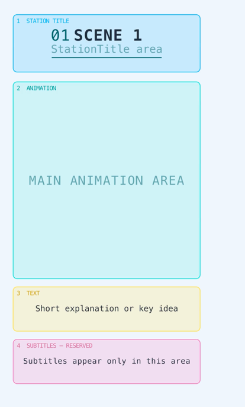

# Animation Layout

This directory contains a visual layout template used for all animations in the project 
(except for the episode about lexical analysis).

The template defines how content is organized inside a vertical video frame and ensures that every scene follows the same visual structure.



## General structure

Each animation consists of several vertically arranged scenes.

The camera moves from one scene to another, creating one continuous animation instead of a sequence of disconnected shots.

Every scene uses the same four content areas:

1. **Station Title**
2. **Animation Area**
3. **Text Area**
4. **Subtitle Area**

This shared structure keeps all episodes visually consistent and makes it easier to create new animations.

## 1. Station Title

The Station Title area is located at the top of each scene.

It contains:

* the scene number;
* the scene name;
* a short description of the current stage.

For example:

```text
01
TOKEN STREAM
The parser reads tokens from left to right
```

The Station Title introduces the current part of the explanation before the main animation begins.

Important animation objects should not be placed inside this area.

## 2. Animation Area

The Animation Area is the main working space of the scene.

It contains all visual objects used to explain the concept, such as:

* tokens;
* source code;
* arrows;
* syntax trees;
* graphs;
* tables;
* state transitions;
* algorithm steps.

All major transformations and object movements should happen inside this area.

The size of this area is intentionally larger than the other sections because it contains the main visual explanation.

## 3. Text Area

The Text Area is located below the animation.

It is used for short explanations that are part of the animation itself.

Typical content includes:

* the current parser rule;
* a short definition;
* an important condition;
* the result of the current step;
* a brief summary.

The text should remain short and should support the visualization rather than repeat the entire narration.

For example:

```text
The parser returns a completed subtree.
```

Objects from the main animation should not move into this area.

## 4. Subtitle Area

The Subtitle Area is reserved exclusively for video subtitles.

It is located inside the platform-safe part of the frame, below the Text Area.

No animation objects, labels, diagrams, or explanatory text should be placed in this area.

Keeping this area empty ensures that subtitles can be added later without covering important visual content.

The Subtitle Area is not normally created or animated inside individual scenes. It only acts as a reserved layout boundary.

## Camera movement

The scenes are arranged vertically along the Y-axis.

Each scene has its own camera position:

```yaml
camera:
  scene_1_y: 1.2
  scene_2_y: -14.8
```

The camera starts at the first scene and then smoothly moves downward to the next one.

```text
Scene 1
   ↓
Scene 2
   ↓
Scene 3
```

This creates the feeling of moving through a continuous visual explanation.

The distance between scenes should be large enough to prevent content from neighboring scenes from appearing inside the camera frame.

## Configuration

All layout values are stored in `config.yaml`.

The configuration controls:

* camera positions;
* frame dimensions;
* content boundaries;
* zone dimensions;
* colors;
* opacity;
* border width;
* corner radius;
* font;
* font size;
* labels;
* animation timing.

This prevents layout values from being hard-coded inside the Manim scene.

For example:

```yaml
animation_zone:
  top: 4.15
  bottom: -1.85
  color: "#00F5D4"
  fill_opacity: 0.14
  stroke_width: 2
  corner_radius: 0.12
```

The Python code reads these values and creates the corresponding area automatically.

## Layout rules

When creating a new animation, follow these rules:

* keep the Station Title inside the title area;
* keep all main visual objects inside the Animation Area;
* keep explanatory text inside the Text Area;
* leave the Subtitle Area empty;
* do not place important content close to the frame edges;
* do not allow objects from different scenes to overlap;
* use camera movement to transition between scenes;
* store adjustable layout values in `config.yaml`.

## Purpose of the test scene

The test animation displays all four areas using different colors.

It is used to verify:

* whether the zones fit inside the camera frame;
* whether the content remains readable;
* whether the subtitle area stays empty;
* whether objects are positioned consistently;
* whether neighboring scenes remain outside the visible frame;
* whether the layout works correctly for vertical video.

The colored backgrounds are only used for layout testing.

They should not appear in the final educational animations.
